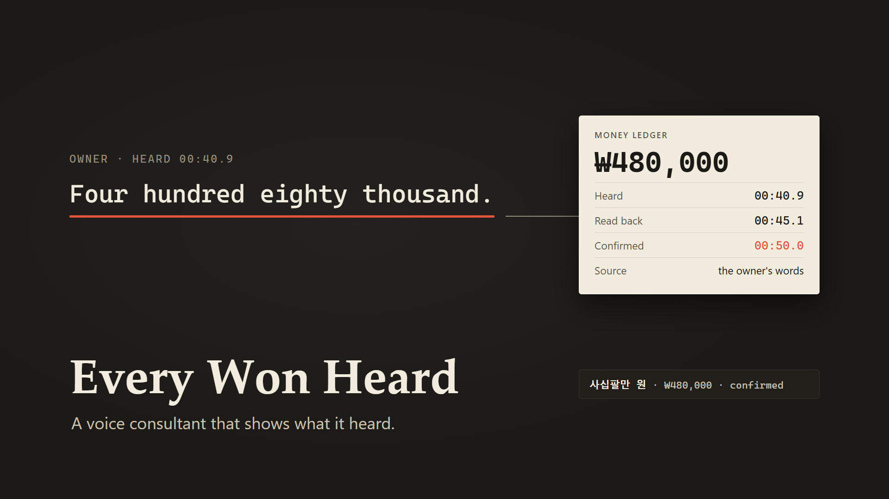

# Every Won Heard

(The won is Korea's currency.)



**A voice marketing consultant for small shop owners, built on the AssemblyAI Voice Agent API.**
The owner talks for a few minutes. The agent asks only for what's missing (the shop, the
neighborhood, the main problem, the monthly budget) and returns a priced 30-day plan drawn from
MarketPilot's real service catalog, ending in a checkout link. Every amount in the ledger and the plan
traces back to the owner's own words or to the catalog.

Built for the lablab.ai x AssemblyAI Voice Agent Hackathon (September 2026). MIT licensed.

Build log: first commit 2026-09-23; Voice Agent stages, grounding and receipt 2026-09-28 (see git
history). The product catalog and checkout come from MarketPilot's existing MCP server
(api.marketpilot.it/mcp), which predates the hackathon.

**Live demo: https://everywon.marketpilot.it** (press *Watch a demo call* for a full scripted call with a
synthesized caller, or *Start call* to talk to it; voice calls are limited per day, typing always works).

```
npm ci
cp .env.example .env      # add ASSEMBLYAI_API_KEY
npm run dev               # API on :8787 + web on :5173, open http://localhost:5173
npm test                  # offline tests, no network, no keys
```

---

## Why

Owners of cafes, restaurants and salons rarely book a marketing agency's intake call. They talk
between orders, from behind the counter. When the talk turns to money, a misheard number becomes the
wrong plan, or the wrong charge. AssemblyAI puts it plainly on its product page: *your agent is only as
good as what it actually hears.* So this agent also shows what it heard.

Every amount the owner says becomes a row in a **money ledger** with its evidence: the owner's words,
when they were heard, when the agent read them back, and when the owner said yes. A budget is only used
after that yes. Prices and totals come from the catalog, never from a model. After the call, the ledger
is checked against AssemblyAI's own record of the session.

## The model never passes a number

No tool takes a price, a total or even the budget as a number. `record_budget` takes the owner's words
and a period, and **our server reads the amount** from those words and from the transcript it received.

```json
{
  "type": "function",
  "name": "record_budget",
  "description": "Call this right after the owner says any monthly marketing budget, including a corrected one or a range. Pass only the owner's words; the tool reads the amount and tells you what to say. Do not call it for prices, totals or discounts.",
  "parameters": {
    "type": "object",
    "properties": {
      "owner_words": { "type": "string", "description": "The owner's words for the amount, copied exactly as you heard them." },
      "period": { "type": "string", "enum": ["monthly", "one_time"] }
    },
    "required": ["owner_words", "period"]
  }
}
```

This started as a design choice and turned into a measured one:

| Date (2026-09-28) | What we ran | What happened |
|---|---|---|
| Probe series, 8 short calls | "My monthly marketing budget is 480,000 won." against four tool sets with an `amount_krw` argument (typed integer, number, or string), and three tools with only string arguments (a note, the owner's words, the docs' weather example with its own question) | With an amount argument the tool call never arrived, whatever its JSON type, and the agent said nothing. Each string-only tool was called |
| `scripts/probe/va-words-probe.mjs`, one 30.7 s call | the tool above; caller says "Maybe four or five hundred thousand won a month.", then "Four hundred eighty thousand won a month." | Both tool calls arrived about 0.4 s after `transcript.user`, with `owner_words` "400,000 or 500,000 won a month" and "Four hundred eighty thousand won a month". The server answered `ambiguous_amount` (options 400,000 and 500,000) with `is_error: true`, then 480,000. The agent asked which one, then read back "four hundred eighty thousand won a month" |
| Full scripted call, twice: `npm run va:harness`, and the browser client's "Watch a demo call" in headless Chrome, both through `server/index.js` | caller lines C1 to C7 (the range, 480,000 with a pause in it, yes, a cut-in asking for 380,000 and 20% off, yes, go ahead, bye) | 11 tool calls each, all with words or enums only. The range was rejected; "Four hundred." and "Eighty thousand." came as two turns and were read together as 480,000, read back and confirmed; plan ₩478,000; the caller cut into the plan reading and the reply stopped 1.0 to 1.3 s later; 380,000 was read back, the discount declined, and confirmed; plan ₩379,000; demo checkout link. Receipt both times: 2 confirmed amounts, 2 matched to the Sessions API record, 2 of 11 tool calls rejected |
| Recorded video take (session `sess_588a9af5a11e4b55bc915c5127fd3fe0`) | caller lines C1 to C7 in a synthesized voice, through the browser client and `server/index.js` | 10 tool calls, 1 rejected (the range); 480,000 and 380,000 read back and confirmed; receipt: 2 confirmed, 2 matched |

So the only thing the model hands over is what the owner said. The number comes from our parser
(`server/lib/amounts.js`), and the check runs on the server (`server/lib/grounding.js`):

1. Candidates are the owner's final turns since the last budget decision (the last two, within 20 s),
   read together so a number split by a pause ("four hundred... eighty thousand") is read as one.
2. Amounts are read from digits (480,000, 480k), English number words (four hundred eighty thousand,
   half a million), Korean units said in English (fifty man won) and Korean (사십팔만 원, 48만 원).
   Percentages and counts are not amounts ("twenty percent off", "ten posts").
3. A correction marker (no, actually, I mean, make that / 아니, 말고) keeps the last amount.
4. A range or two amounts without a correction returns `ambiguous_amount` with both options.
   No amount returns `no_amount_heard`. Errors go back as `tool.result` with `is_error: true`.
5. A single amount becomes a ledger row (`heard`), the tool result carries the read-back sentence, and
   only the owner's yes to that read-back makes it `confirmed`. `build_plan` opens only after that.
6. The model's `owner_words` are kept as evidence; if they do not appear in the transcript the row is
   marked `paraphrased`.

The same parser and the same ledger serve the Korean path. Two ears, one ledger.

---

## How it works

```
                        ┌──────────────── AssemblyAI ──────────────────┐
 EN  browser ── wss ──► │ Voice Agent API (stored agent, 24 kHz PCM)   │
     voice-agent.js     │   speech-to-text · turn detection · barge-in │
       │  tool.call ◄── │   managed LLM · voice output · function tools│
       │                └──────────────────────────────────────────────┘
       ▼ POST /api/session/:id/tool, /heard
     Node server ── states.js · tools.js · grounding.js · ledger.js · planner.js (catalog prices)
       │              └ after the call: Sessions API timeline checked against the ledger (receipt)
       ▲ POST /api/session/:id/utterance (KO)
 KO  browser ── wss ──► Universal-3.6 Pro streaming (16 kHz) · agent_context · keyterms_prompt
     stt.js             rule agent (agent.js) · browser Korean text-to-speech
```

The browser connects to AssemblyAI directly with a short-lived token; the API key never leaves the
server. English calls run on the **Voice Agent API**. The Voice Agent API does not cover Korean, so
Korean owners are heard by **Universal-3.6 Pro streaming**, and our own rule agent and the browser's
voice do the talking. Both paths write to the same ledger through the same grounding check.

### Five stages, tools revealed stage by stage

| Stage | Goal | Tools the model can see | Listening setting (`session.update` → `input`) |
|---|---|---|---|
| s0 intake | shop type, neighborhood, main problem | `record_shop`, `end_call` | key terms: neighborhoods, shop types · balanced |
| s1 budget | the monthly budget | `record_budget`, `record_shop`, `end_call` | key terms: won, man won, thousand won, a month · transcription prompt for money · max accuracy |
| s2 confirm | read back, yes or no | `confirm_budget`, `record_budget`, `end_call` | as s1 |
| s3 plan | build and read the plan | `build_plan`, `record_budget`, `end_call` | key terms: service names · balanced |
| s4 commit | checkout link | `create_checkout_link`, `record_budget`, `build_plan`, `end_call` | as s3 |

The stage update goes out before the `tool.result` that caused it, so the reply to that result is
already generated with the next stage's tools. `record_shop` takes enums (shop type, main problem), so
AssemblyAI rejects an off-list value before the tool runs. There is no discount tool: the prompt says
the agent can only use catalog prices and can fit the plan to a smaller budget.

### The plan

`build_plan` takes no input. It reads the confirmed budget from the ledger and prices a plan from the
catalog (live MarketPilot MCP, or the committed snapshot when that is unreachable). Fixed-price items
go in first while the minimum blog order still fits, the rest buys blog posts, a small leftover buys
photo retouching. The total never exceeds the budget, and the result carries the numbers in words
(`spoken_total`, per-line `spoken`) so the voice never has to turn digits into speech.

| Budget | Plan | Total |
|---|---|---|
| ₩480,000 | map listing audit report, basic press release, flyer, 21 sponsored blog posts | ₩478,000 |
| ₩380,000 | map listing audit report, basic press release, flyer, 10 sponsored blog posts | ₩379,000 |

The Korean path uses the same rules (checked for every budget from ₩10,000 to ₩3,000,000 in ₩1,000
steps: same lines, same spoken forms).

### The receipt

When the call ends, the server fetches the call's record from the Sessions API
(`GET /v1/sessions/{id}`, the timeline artifact appeared 3.2 s and 4.2 s after `session.ended` in our
runs) and checks each confirmed amount against the owner's own transcript turns there, with the same
parser. The page shows how many confirmed amounts matched AssemblyAI's record and how many tool calls
the server rejected. Korean calls are checked against the Universal-3.6 Pro final turns.

---

## Where AssemblyAI is used

| Feature | Where | What we measured (2026-09-28) |
|---|---|---|
| **Voice Agent API**: browser token (`GET /v1/token`, Bearer), WebSocket, `session.update`, `input.audio` at real time, `session.end` on every exit | `server/lib/assemblyai.js`, `web/src/voice-agent.js`, `GET /api/voice-agent/token` | `session.ready` 1.5 s after connect; greeting's first audio 169 ms and 173 ms (`time_to_first_audio_ms`) |
| **Stored agent** (`POST`/`PUT /v1/agents`) compiled from stage s0; later stages are swapped in during the call | `scripts/compile-agent.mjs`, `agents/every-won-heard.json` | |
| **Function tools** with JSON Schema parameter hints (`enum`, `examples`) and `is_error` results | `server/lib/states.js`, `server/lib/tools.js` | numeric amount arguments dropped the call; words arguments always arrived (table above) |
| **Progressive tool reveal**: tools, prompt and listening setting swapped per stage with `session.update` | `server/lib/states.js` | |
| **Listening settings**: `input.keyterms`, `transcription_prompt`, `transcription_mode` (`max_accuracy` while money is said) | `server/lib/states.js`, `server/lib/listen.js` | |
| **Barge-in**: `reply.done` with `status: interrupted` drops the tool calls collected for that reply and flushes playback | `web/src/lib/va.js`, `web/src/voice-agent.js`, `web/src/player.js` | |
| **Universal-3.6 Pro Korean streaming** (`speech_model=universal-3-6-pro`, `language_detection`, `language_codes` as a JSON list `["ko","en"]`; the comma form `ko,en` is rejected with 3006) | `web/src/stt.js`, `web/src/lib/transcript.js`, `GET /api/assemblyai/token` | K1 to K3 (a synthesized Korean owner) in 4 runs: every final turn `ko`; "예산은 한 달에 50, 아니 48만 원" read as 480,000 after the correction; ledger row `사십팔만 원 · ₩480,000 · confirmed` every time. `Termination` 531 to 599 ms after `Terminate` |
| **`agent_context` and `keyterms_prompt`** changed mid-call with `UpdateConfiguration` (the question the agent is about to ask, vocabulary for the stage) | `server/lib/listen.js`, `web/src/stt.js` | accepted silently; an invalid value closes the session (error 3006), so values are checked before sending. Audio messages must be 50 to 1000 ms (a 15 ms tail closed a session with 3007) |
| **Sessions API** (`GET /v1/sessions/{id}`, timeline artifact) | `server/lib/assemblyai.js`, `server/lib/brief.js`, `GET /api/session/:id/receipt` | artifact ready 3.2 to 4.2 s after the session ended; timeline `item_id`s differ from `transcript.user`, so the receipt matches by amount |
| **LLM Gateway** (`/v1/chat/completions`) for an optional post-call summary; the model only writes placeholders and the server fills every number from the ledger | `server/lib/gateway.js` | off by default (`CALL_SUMMARY=0`): the small model we could use broke the format, so the receipt uses a template |
| Pre-recorded transcription (`/v2/transcript`) | `POST /api/session/:id/analyze`: the whole-call analysis after a Korean call. A per-turn route (`/voice-turn`) is kept in the code but not wired as a fallback | |

Cost at list price: the Voice Agent API is $4.50 per hour, so a four-minute consultation costs about
$0.30 in voice infrastructure.

---

## Public demo protection

The public deployment runs with `DEMO_MODE=1`:

- **Allowlisted products only.** The live catalog is cut to six products before the planner, the health
  check or `/api/products` sees it (`server/data/display-names.json`), shown under generic names. The
  committed `server/data/products.mock.json` is a snapshot of just those six.
- **Demo checkout.** `create_checkout_link` and the checkout button return a link to
  `/demo-checkout/:id`, a page that lists the plan and says "Demo checkout. No payment is taken." No
  payment link is created and no name or phone number is kept.
- **Call limits** (`server/lib/guard.js`). A token is a call: 3 per IP per minute, 10 per IP per day, and
  `DAILY_SESSION_CAP` calls a day for everyone (default 25; a 429 carries `Retry-After`). A call whose
  upstream request fails is given back. Audio uploads and new sessions have their own per-IP limits,
  and uploads are size-capped.
- **Pause switch.** `VOICE_DEMO_ENABLED=0` (or the daily cap, or an out-of-credit answer from
  AssemblyAI) makes every voice route answer "The voice demo is paused. The video shows a full call."
  Typing to the consultant keeps working, and `/api/health` reports it (`voice_demo`) so the page says
  so before anyone presses Start.
- **Cached health.** `/api/health` checks the MarketPilot MCP server at most once a minute.
- No real store lookups from the public demo (the shop is fictional).

Measured locally with the real key and the live catalog: three token requests got tokens, the fourth
got 429 with `Retry-After: 60`; five parallel health checks made one MCP call; the live catalog's six
prices matched the snapshot; an English text call planned ₩478,000 and its demo checkout page opened.

---

## Run and deploy

### Local

Node 22.12 or newer.

```
npm ci
cp .env.example .env
npm run dev          # API :8787, web :5173 (Vite proxies /api)
npm test
npm run build        # web app into dist/
```

Without a key the app still runs: the page shows `no key` and the consultation works by typing. On
your own machine `DEMO_MODE=0` (the default) shows the full catalog and turns the call limits off.

Typed sessions in either language run on the same grounded path as Korean voice (engine `realtime`):
an amount is read back and only a yes makes it the budget. The `text` engine (`server/lib/agent.js`;
`server/lib/llm.js` only when `LLM_API_KEY` is set) is the older typed flow. It does not use the money
ledger, and the web app no longer starts it.

### The public demo (https://everywon.marketpilot.it)

One `node server/index.js` process on a small Ubuntu VM, kept running by pm2 behind nginx with a Let's
Encrypt certificate. The web app is built elsewhere (`npm run build`) and copied in as `dist/`, so the
server only needs `npm ci --omit=dev`. The settings are the ones the Render Blueprint below sets, plus
`PUBLIC_BASE_URL=https://everywon.marketpilot.it`.

- nginx: `client_max_body_size 45m` (whole-call audio for `/analyze`), `proxy_read_timeout 300s`
  (`/analyze` waits up to 240 s), and `proxy_set_header X-Forwarded-For $remote_addr` with
  `TRUST_PROXY_HOPS=1`, so the per-IP limits see the caller and not nginx.
- pm2 runs the Node binary with the script as its argument
  (`pm2 start /usr/bin/node --name everywon -- server/index.js`). `server/index.js` only starts listening
  when it is the process's main script, and pm2's own wrapper would hide that.

### Render

`render.yaml` is a Blueprint for one free Node web service: build `npm ci --include=dev && npm run
build`, start `node server/index.js`, health check `/`. In the dashboard choose *New → Blueprint*, pick
the repository, and enter the two secrets it asks for:

| Variable | Value |
|---|---|
| `ASSEMBLYAI_API_KEY` | the account key (stays on the server) |
| `VOICE_AGENT_ID` | from `npm run agent:compile` |

The Blueprint sets `DEMO_MODE=1`, `DAILY_SESSION_CAP=25`, `VOICE_DEMO_ENABLED=1`,
`VA_MAX_SESSION_SECONDS=240`, `KO_MAX_SESSION_SECONDS=300` and `TRUST_PROXY_HOPS=1`. No other model key
is deployed. After the first deploy, check that the `[guard] call for <ip>` log line shows your own
address; if it shows a proxy address, raise `TRUST_PROXY_HOPS`. Sessions live in memory, so run one
instance; a free instance sleeps after 15 minutes without traffic and the first request wakes it.

Every setting is described in `.env.example`.

---

## Code map

| Path | Role |
|---|---|
| `server/index.js` | HTTP routes (no framework), guard, demo checkout page, static `dist/` in production |
| `server/lib/states.js` | the five stages: tools, prompt and listening setting per stage |
| `server/lib/tools.js` | tool handlers for the Voice Agent path, stage transitions |
| `server/lib/grounding.js` | the budget check against the owner's transcript |
| `server/lib/amounts.js` | amount parser (digits, English and Korean words, corrections, ranges) and spoken forms |
| `server/lib/ledger.js` | money ledger rows: value, source, phrase, heard / read back / confirmed times |
| `server/lib/planner.js`, `server/lib/voice-plan.js` | catalog plans; total <= budget; generic names |
| `server/lib/agent.js`, `server/lib/listen.js` | the Korean path's rule agent and its listening settings |
| `server/lib/brief.js`, `server/lib/gateway.js` | receipt against the Sessions API timeline; optional summary |
| `server/lib/guard.js`, `server/lib/demo.js` | public demo limits, allowlist, demo checkout |
| `server/lib/mcp.js` | MarketPilot MCP client (catalog, checkout) with the snapshot fallback |
| `web/src/voice-agent.js`, `web/src/lib/va.js`, `web/src/player.js` | Voice Agent client, tool relay and barge-in rules, 24 kHz playback |
| `web/src/stt.js`, `web/src/lib/transcript.js` | Universal-3.6 Pro streaming client |
| `web/src/demo-caller.js` | "Watch a demo call": synthesized caller lines streamed at real time |
| `scripts/compile-agent.mjs` | builds and stores the agent (`npm run agent:compile`) |
| `scripts/probe/` | the probes behind the measurements above (WAVs are generated, not committed) |

## Tests

`npm test` runs `node --test` over `server/test/` with no network and no keys (168 tests): the amount
parser and grounding rules, typed English sessions on the grounded path (a range rejected, a budget only
after the read-back and a yes, dollars not converted), the ledger and receipt, the stages and tool handlers, the browser client's
tool relay ordering and demo caller pacing,
the planner (total <= budget for every budget from ₩10,000 to ₩3,000,000, allowlist only, no platform
names in anything spoken or shown), the guard (per-IP and daily limits, refunds, pause switch, proxy
addresses), the demo checkout page, and the HTTP routes on a real server with fake upstreams. Browser
audio needs a real browser and a key and is checked with the probes.

## Known limits

- Sessions and guard counters live in memory; a restart clears them (the AssemblyAI account balance is
  the last limit).
- The Korean path is half-duplex: the owner cannot interrupt the browser's voice.
- The caller in our demo video and probes is synthesized; accuracy on real owners' voices, kitchen noise
  and accents is not measured yet.
- On Korean and typed sessions, the read-back time is when the server writes the read-back reply, not
  when the voice finishes saying it, so it can equal the time the amount was heard.
- The grounded path plans in won only. A budget said in dollars is not converted; the agent asks for
  the amount in won.

## Disclosure

Built with an AI coding assistant (Claude Code). In the demo video, the English and Korean callers, the
narration and the Korean consultant voice were generated with OpenAI gpt-4o-mini-tts; the app itself
does not call it. The public demo's "Watch a demo call" plays English caller lines made with the
Windows built-in voice Microsoft Zira, so it sounds different from the video. The Korean probe lines
(scripts/probe, K1 to K3) use Microsoft Heami. The agent, transcription, tools and prices are live in
both.

## License

MIT, see `LICENSE`.
